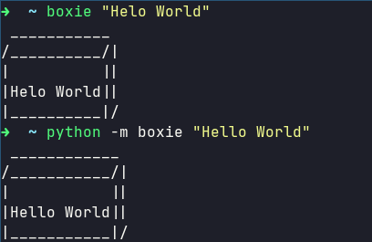

# boxie

A command line utility to put text in a box.

## Installation

```bash
pip install boxie
```

If you are on Linux you may need to use sudo to access this globally.

## Usage

```bash
boxie "Hello World"
```

Or...

```bash
python -m boxie "Hello World"
```

Or in your code:

```python
from boxie import box_borders
@box_borders
def print_console(txt):
    print(txt)
print_console("Hello World")
```

Check [test.py](./test.py)

### Screenshot



### LICENSE

[MIT](./LICENSE)
